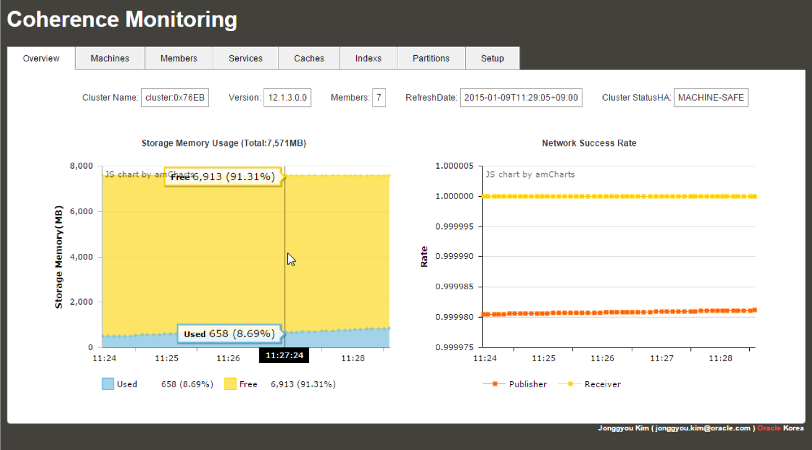
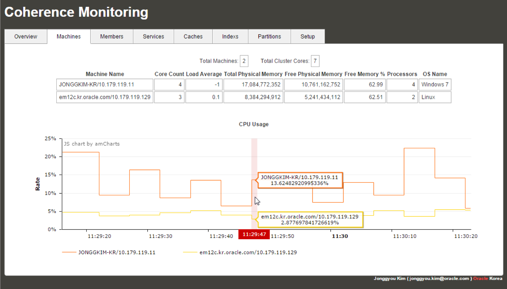
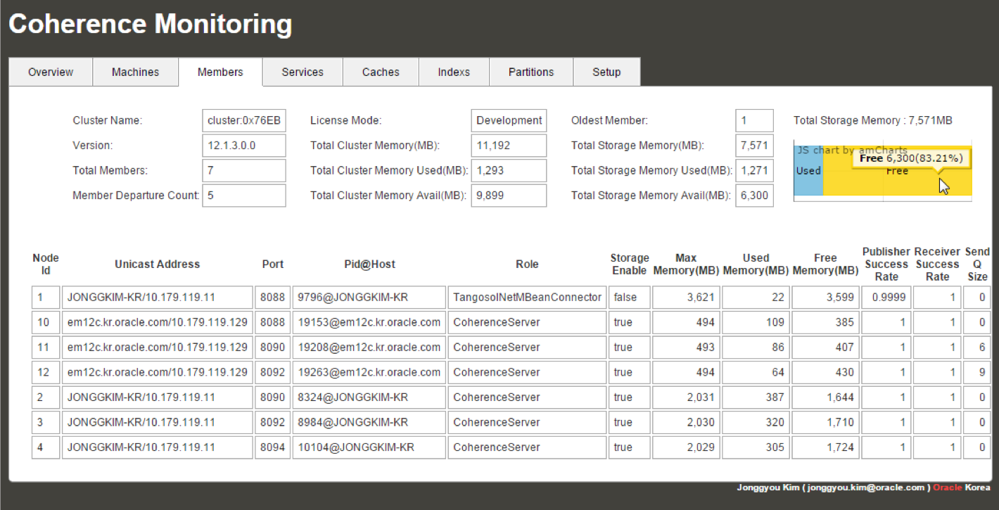
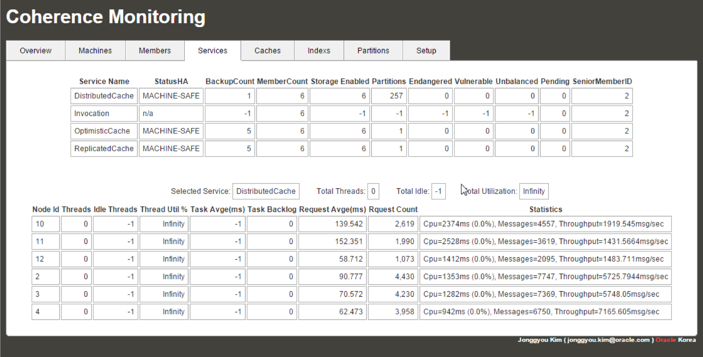
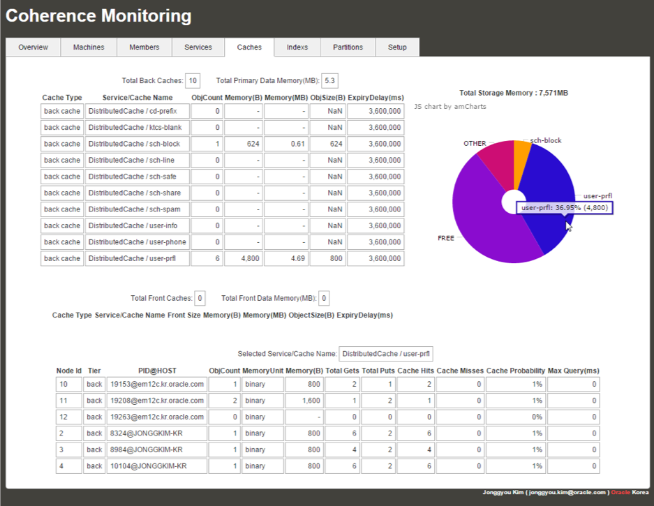
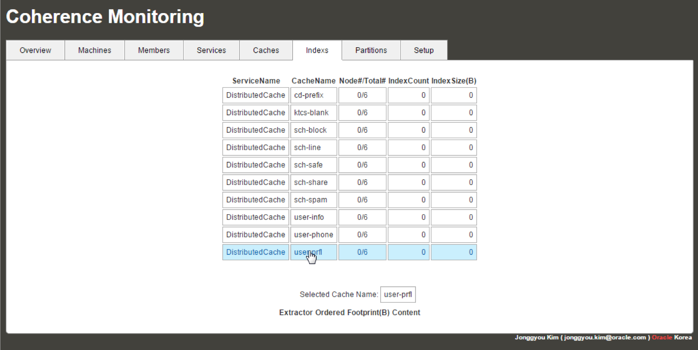
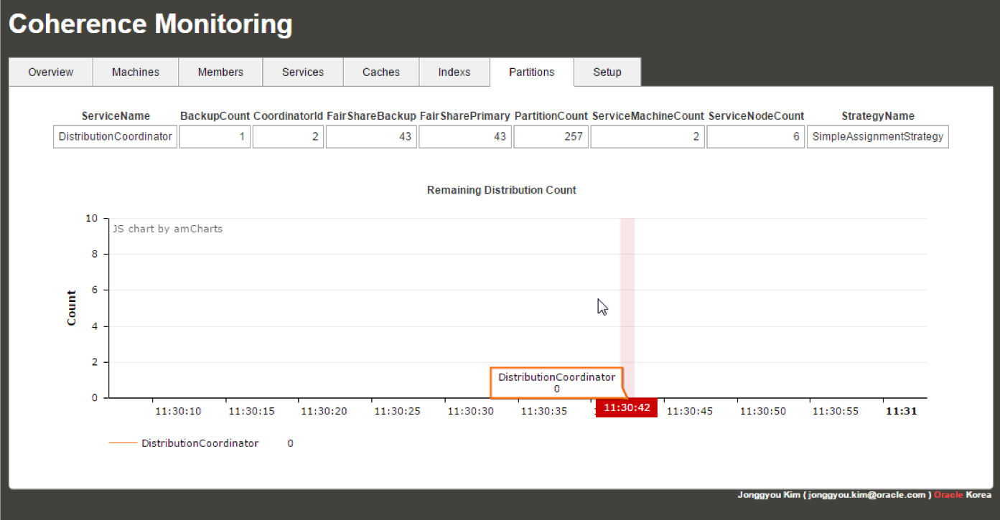
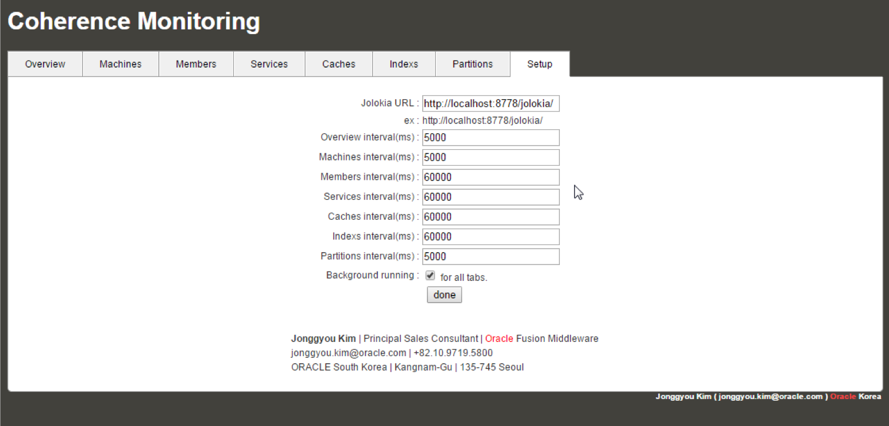

# Coherence Information Monitoring in Terminal

You can get information of Coherence in your Terminal.

Do not remove "`Coherence Information by JongGyou Kim (jonggyou.kim@oracle.com)`" in source file.

## Screenshot









## Run

- Run MBeanConnector
```sh
java -showversion -cp coherence.jar -Dtangosol.coherence.distributed.localstorage=false -Dtangosol.coherence.management=all -Dcom.sun.management.jmxremote.ssl=false -Dcom.sun.management.jmxremote.authenticate=false -Dtangosol.coherence.management.remote=true com.tangosol.net.management.MBeanConnector -rmi
```
- Run CoherenceInfo
```sh
java -showversion -cp .:coherence.jar -Dtangosol.coherence.distributed.localstorage=false com.oracle.coherence.info.CoherenceInfo %*
```